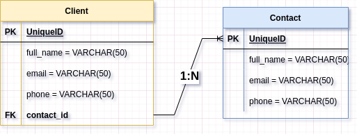

# Agenda API

## Sumário:

- [Agenda API](#agenda-api)
  - [Sumário:](#sumário)
  - [1. Início Rápido](#1-início-rápido)
  - [2. Tecnologias Usadas](#2-tecnologias-usadas)
  - [3. Documentação da API](#3-documentação-da-api)
  - [4. Diagrama Agenda API](#4-diagrama-agenda-api)

## 1. Início Rápido

[Voltar ao topo.](#tabela-de-conteúdos)

Clone o projeto em sua máquina e instale as dependências com o comando:

```shell
yarn
```

Suba o ambiente Docker com o comando abaixo:

```shell
docker compose up
```

Em seguida, crie um arquivo **.env**, copiando o formato do arquivo **.env.example**:

```
cp .env.example .env
```

Configure suas variaveis de ambiente com suas credenciais do Postgres e uma nova database da sua escolha caso nao queira usar as configurações do docker pré estabelecidas.
Configuração padrão:

```env
POSTGRES_USER=postgres
POSTGRES_PASSWORD=postgres
POSTGRES_DB=default
```

## 2. Tecnologias Usadas

[Voltar ao topo.](#tabela-de-conteúdos)

## 3. Documentação da API

[Voltar ao topo.](#tabela-de-conteúdos)

## 4. Diagrama Agenda API

[Voltar ao topo.](#tabela-de-conteúdos)


